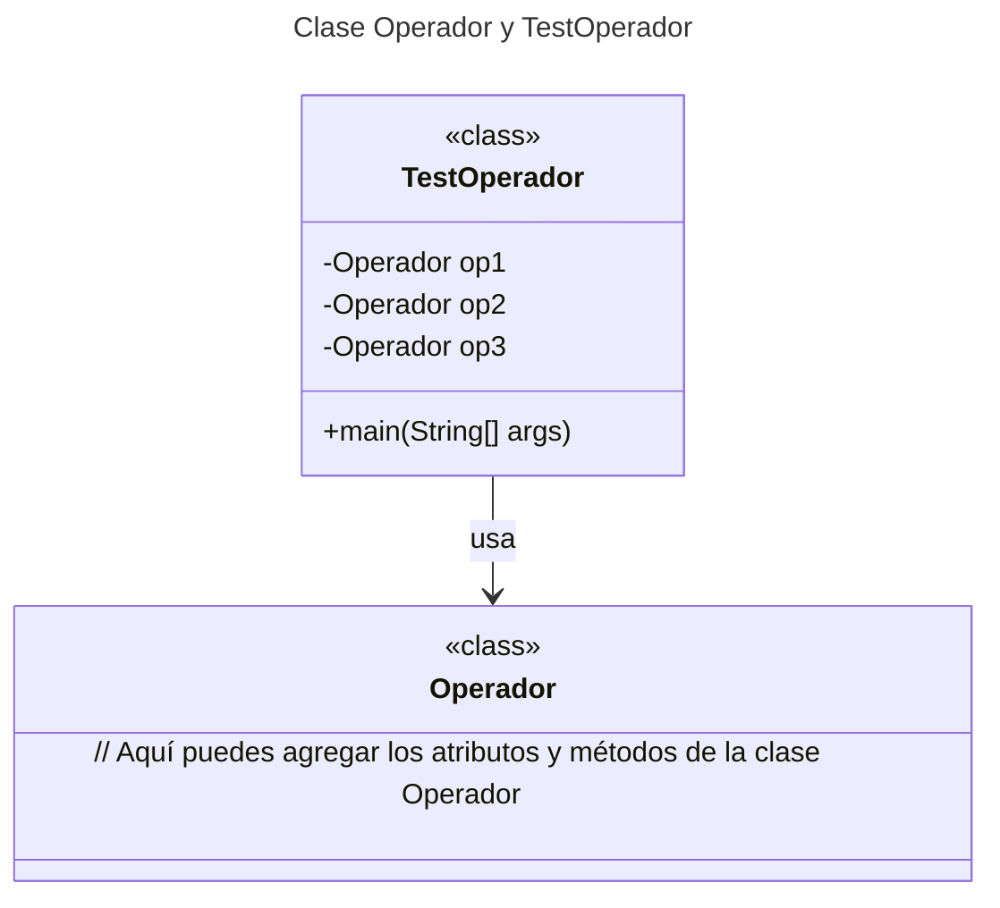
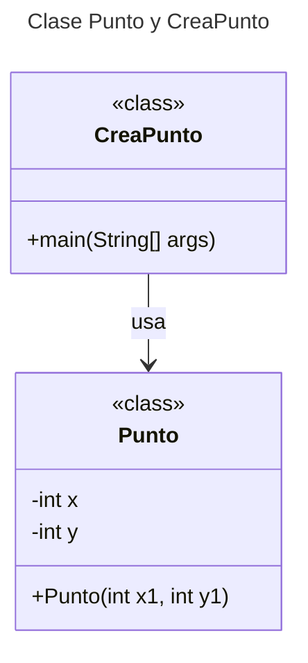
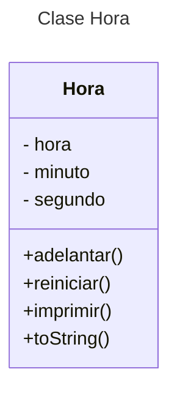
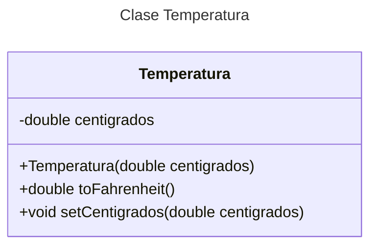
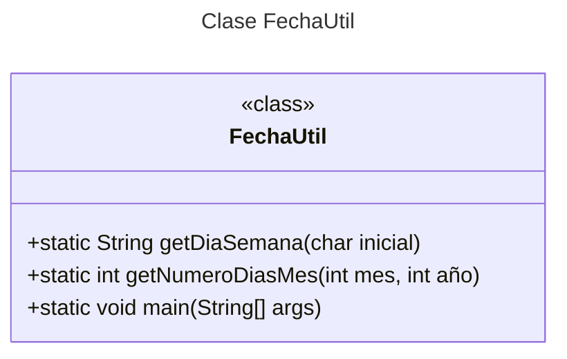

# Proyecto - Examen Unidad II de Programación Orientada a Objetos
1. Dado el siguiente programa 

    La clase Punto representa un punto en un plano cartesiano con coordenadas x e y. 

        public class Punto{
            public int x;
            public int y;

            public Punto(int x1, int y1) {
                x = x1;
                y = y1;
            }
        }

    La clase CreaPunto es una clase que se utiliza para crear y manipular objetos de la clase Punto.

        public class CreaPunto {
            public static void main(String[] args) {
                Punto p1 = new Punto();
                Punto p2 = new Punto(5, 6);
                
            }
        }

    ¿qué es lo que esta incorrecto? hagas las correcciones pertinentes

2. Dada la siguiente clase Operador:

        public class Operador {
            public float memoria;
            public Operador(){
                System.out.println("Activar máquina operador");
                memoria =0.0f;
            }

            public float sumar(float f){
                memoria = memoria + f;
                return memoria;
            }

            @Override
            protected void finalize(){
                //coloque el código faltante
            }
            
        }
    Escribir el método finalize() y un programa que cree objetos, después se 
    pierdan las referencias a los objetos creados y se active el método finalize()

3. Implementar una clase Hora; donde cada objeto presente una hora específica del día, almacendo
    horas, minutos y segundos como enteros.

    Incluir un constructor por omisión y un contructor con tres parámetros (hora,minuto y segundo), crear los getter y setter necesarios, así como un método **adelantar** con tres parámetros (hora, minuto y segundo) para actualizar la hora de un objeto existence, un método **reiniciar** (hora, minuto y segundo) que reinicie la horas actual de un objeto existente y un método **imprimir** que imprima un String en la forma (HH:MM:SS), sobre escriba el método toString

4. Implementar una clase Temperatura;  que permite manejar y convertir valores de temperatura en grados Centígrados a Fahrenheit.

    Atributo centigrados: Es una variable privada que almacena el valor de la temperatura en grados Centígrados.

    Constructor Temperatura(double centigrados): Inicializa el objeto Temperatura con un valor específico en grados Centígrados.

    Método toFahrenheit(): Convierte la temperatura de grados Centígrados a Fahrenheit utilizando la fórmula (centigrados * 9/5) + 32.

    Método setCentigrados(double centigrados): Permite establecer un nuevo valor para la temperatura en grados Centígrados.

    Método getCentigrados(): Devuelve el valor actual de la temperatura en grados Centígrados.

    Método main(String[] args): Es un ejemplo de uso de la clase Temperatura. Crea un objeto Temperatura con un valor inicial de 25 grados Centígrados, y luego imprime la temperatura en Fahrenheit y en Centígrados.

5. El programa deberá defini una clase **FechaUtil** que proporciona utilidades relacionadas con fechas.

    Clase FechaUtil: Es una clase pública que contiene métodos estáticos para trabajar con fechas.

    Método getDiaSemana(char inicial):

        Descripción: Este método acepta una letra inicial (mayúscula o minúscula) y devuelve el nombre del día de la semana correspondiente.

        Parámetro:
        inicial: Un carácter que representa la inicial del día de la semana.

        Retorno:
        Devuelve una cadena con el nombre del día de la semana correspondiente a la inicial proporcionada.
        Si la inicial no es válida, devuelve "Inicial no válida".
        Implementación:
        Utiliza un switch para convertir la letra inicial a minúscula y devolver el nombre del día de la semana correspondiente.
        Las iniciales válidas son:
        'l' o 'L' para "Lunes"
        'm' o 'M' para "Martes"
        'x' o 'X' para "Miércoles"
        'j' o 'J' para "Jueves"
        'v' o 'V' para "Viernes"
        's' o 'S' para "Sábado"
        'd' o 'D' para "Domingo"

        Si la inicial no coincide con ninguna de las anteriores, devuelve -1 que indica"Inicial no válida".
    
    Método getDiaSemana(char inicial): 
    
        Devuelve el nombre del día de la semana basado en la letra inicial proporcionada.

    Método main(String[] args): 
    
        Método principal que prueba los métodos getDiaSemana y getNumeroDiasMes.

## Diagrama de clases
[Editor en línea](https://mermaid.live/)









[Referencia-Mermaid](https://mermaid.js.org/syntax/classDiagram.html)

## Diagrama de clases UML con draw.io
El repositorio está configurado para crear Diagramas de clases UML con ```draw.io```. Para usarlo simplemente agrega un archivo con extensión ```.drawio.png```, das doble clic sobre el mismo y se activará el editor ```draw.io``` incrustado en ```VSCode``` para edición. Asegúrate de agregar las formas UML en el menú de formas del lado izquierdo (opción ```+Más formas```).

## Uso del proyecto con make

### Default - Compilar+Probar+Ejecutar
```
make
```
### Compilar
```
make compile
```
### Probar todo
```
make test
```
### Ejecutar App
```
make run
```
### Limpiar binarios
```
make clean
```
## Comandos Git-Cambios y envío a Autograding

### Por cada cambio importante que haga, actualice su historia usando los comandos:
```
git add .
git commit -m "Descripción del cambio"
```
### Envíe sus actualizaciones a GitHub para Autograding con el comando:
```
git push origin main
```
## Comandos individuales
### Compilar

```
find ./ -type f -name "*.java" > compfiles.txt
javac -d build -cp lib/junit-platform-console-standalone-1.5.2.jar @compfiles.txt
```
Ejecutar ambos comandos en 1 sólo paso:

```
find ./ -type f -name "*.java" > compfiles.txt ; javac -d build -cp lib/junit-platform-console-standalone-1.5.2.jar @compfiles.txt
```


### Ejecutar Todas la pruebas locales de 1 Test Case

```
java -jar lib/junit-platform-console-standalone-1.5.2.jar -class-path build --select-class miTest.AppTest
```
### Ejecutar 1 prueba local de 1 Test Case

```
java -jar lib/junit-platform-console-standalone-1.5.2.jar -class-path build --select-method miTest.AppTest#appHasAGreeting
```
### Ejecutar App
```
java -cp build miPrincipal.Principal
```
Los comandos anteriores están considerados para un ambiente Linux. [Referencia.](https://www.baeldung.com/junit-run-from-command-line)
